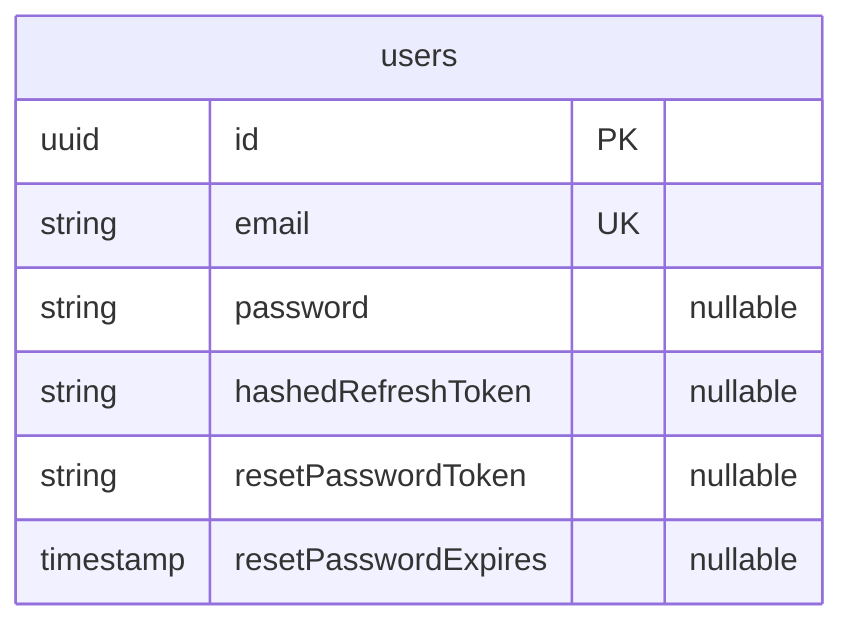

# Enterprise IQ

## 1. Project Overview

**Project Name**: Enterprise IQ  
**Purpose**: Enterprise IQ is a full-stack enterprise chatbot platform that enables organizations to build, deploy, and manage intelligent chatbots capable of accessing and surfacing internal company resources. It serves as a centralized conversational interface where employees can query knowledge bases, retrieve documents, interact with enterprise data, and automate routine tasks — all through natural language.

**Key Features**:
- Enterprise-grade chatbot for accessing company resources and knowledge
- AI-powered conversational interface with multi-model orchestration (GPT-4o, Claude 3.5, Gemini Pro, Llama 3)
- Workspace management with collapsible sidebar and chat session history
- Admin dashboard with real-time analytics (total queries, active users, latency, error rates)
- Role-based access control (Admin, Editor, Viewer) with granular permission management
- User management with search, filtering, role assignment, and status tracking
- Secure user authentication (Email/Password & Google OAuth 2.0)
- Session management using JWT (HttpOnly Cookies)
- Password recovery (Forgot/Reset Password via email)
- Modern, responsive, and polished dark-themed user interface with glassmorphism and micro-animations

**High-Level Architecture Summary**:  
The application follows a client-server architecture. The frontend is a Next.js (React) application utilizing Zustand for state management and React Query for server-state synchronization. The backend is a NestJS application built on Node.js and Express, using TypeORM to communicate with a PostgreSQL database. The platform is designed to be extensible — allowing future integration with AI/LLM providers, vector databases, and enterprise knowledge sources to power intelligent chatbot responses.

**Target Users and Use Cases**:
- **Enterprise employees** who need quick, conversational access to internal resources, documents, and data without navigating complex dashboards.
- **IT & Operations teams** looking to deploy organization-wide chatbot assistants that integrate with existing enterprise systems.
- **Knowledge workers** who want to query company wikis, policies, and project data through natural language.
- **Administrators** who need to manage users, assign roles, and configure granular permissions across the platform.

---

## 2. Technology Stack

### Frontend
* **Framework**: Next.js 16 (App Router), React 19
* **Styling**: Tailwind CSS v4, Radix UI, Framer Motion
* **State Management**: Zustand
* **Data Fetching / Caching**: TanStack React Query v5
* **API Communication**: Axios
* **UI Components**: Shadcn UI, Lucide React (Icons)
* **Build Tools**: ESLint, PostCSS, TypeScript

### Backend
* **Runtime**: Node.js
* **Framework**: NestJS 11, Express
* **Database ORM**: TypeORM
* **Authentication**: Passport.js (JWT, Google OAuth 2.0), Bcrypt
* **Mailing**: Nodemailer
* **Validation**: class-validator, class-transformer

### Database
* **Primary Database**: PostgreSQL
* **Caching Layer**: Not currently implemented
* **Vector Databases**: Not currently implemented

### Infrastructure
* *Note: Docker, Kubernetes, and Cloud configuration files are currently missing from the codebase. Deployment is assumed to be manual or managed by external, uncommitted configurations.*

---

## 3. Project Structure

The repository is organized into a monorepo-style structure separating the backend and frontend.

```text
.
├── backend/                          # NestJS API application
│   ├── src/
│   │   ├── auth/                     # Authentication logic, guards, strategies
│   │   │   ├── dto/                  # Data Transfer Objects (AuthDto, ForgotPasswordDto, ResetPasswordDto)
│   │   │   └── strategies/           # Passport strategies (JWT, Google OAuth)
│   │   ├── common/                   # Shared utilities, decorators, filters
│   │   ├── mail/                     # Email sending services (forgot password)
│   │   ├── users/                    # User entity and database interaction
│   │   │   └── entities/             # TypeORM entity definitions (User)
│   │   ├── app.module.ts             # Root module with TypeORM & config setup
│   │   └── main.ts                   # Application entry point
│   └── package.json                  # Backend dependencies
│
└── enterpriseiq-frontend/            # Next.js Web application
    ├── app/
    │   ├── (auth)/                   # Auth route group
    │   │   ├── sign-in/page.tsx      # Sign-in page (split layout with VantaPanel)
    │   │   └── sign-up/page.tsx      # Sign-up page
    │   ├── (main)/                   # Authenticated route group
    │   │   ├── layout.tsx            # Main layout with Sidebar + WorkspaceContext
    │   │   ├── chat/page.tsx         # AI chatbot interface
    │   │   ├── dashboard/page.tsx    # Analytics dashboard
    │   │   ├── roles/page.tsx        # Role & permission management
    │   │   └── users/page.tsx        # User management table
    │   ├── _components/              # Shared page-level components
    │   │   ├── ChatPgae.tsx          # Chat UI component (empty/active states)
    │   │   ├── Dashboard.tsx         # Dashboard with stat cards & model usage
    │   │   ├── LoginForm.tsx         # Login form component
    │   │   ├── RolesPage.tsx         # Role CRUD + permission toggle matrix
    │   │   ├── Sidebar.tsx           # Persistent sidebar with chat history & profile
    │   │   ├── SignUpForm.tsx        # Sign-up form component
    │   │   ├── Users.tsx             # User management table component
    │   │   └── Vantapanel.tsx        # Animated background panel for auth pages
    │   ├── globals.css               # Global styles, CSS variables, design tokens
    │   ├── layout.tsx                # Root layout
    │   └── page.tsx                  # Landing page
    ├── components/                   # Reusable React components (Shadcn UI)
    ├── hooks/                        # Custom React hooks
    │   ├── mutations/                # React Query mutations (useAuthMutation)
    │   └── queries/                  # React Query queries (useExampleQuery)
    ├── lib/                          # Utility functions (e.g., Tailwind merge)
    ├── providers/                    # React Context providers (React Query, Theme)
    ├── services/                     # Axios API service layer (authService)
    ├── store/                        # Zustand global state (useAuthStore)
    ├── types/                        # TypeScript interfaces and types
    └── package.json                  # Frontend dependencies
```

---

## 4. Frontend Documentation

### Application Flow
Users land on the landing page, navigate to sign-in or sign-up via the `(auth)` route group, authenticate, and are redirected to the main workspace. The `(main)` route group renders a persistent sidebar alongside the active page content.

### Routing Structure
Uses Next.js App Router with route groups:
- `app/(auth)/` — Public authentication pages (sign-in, sign-up)
- `app/(main)/` — Authenticated workspace pages sharing a common layout with sidebar
  - `/chat` — AI chatbot interface
  - `/dashboard` — Analytics and metrics dashboard
  - `/users` — User management
  - `/roles` — Role and permission management

### Component Architecture
- **Sidebar** (`_components/Sidebar.tsx`): Persistent navigation with brand logo, "New Chat" button, collapsible chat history grouped by date (Today/Yesterday/Older), session management (select, delete), and user profile dropdown with sign-out.
- **ChatPage** (`(main)/chat/page.tsx`): Two states — empty state with centered greeting, suggestion chips, and input bar; active state with message bubbles, typing indicator, and pinned input at bottom.
- **Dashboard** (`_components/Dashboard.tsx`): Hero bento card with greeting, stat cards (Total Queries, Active Users, Avg Latency, Error Rate), and model usage breakdown (GPT-4o, Claude 3.5, Gemini Pro, Llama 3) with animated progress bars.
- **RolesPage** (`_components/RolesPage.tsx`): Left column of role cards (Admin, Editor, Viewer) with permission summary bars. Right column is a permission editor with grouped toggles (Queries & Sessions, Workspace, Administration) including dangerous-permission highlighting.
- **UsersManagementPage** (`_components/Users.tsx`): Searchable/filterable user table with avatar initials, role dropdowns, status badges (active/inactive/pending), join dates, and last-seen timestamps.
- **VantaPanel** (`_components/Vantapanel.tsx`): Animated background used on auth pages for visual polish.

### State Management
- **Server State**: Handled by `@tanstack/react-query` (located in `hooks/mutations/` and `hooks/queries/`).
- **Client State**: Handled by Zustand (`store/useAuthStore.ts`) for auth state.
- **Workspace Context**: React Context (`(main)/layout.tsx`) providing sidebar open/close state and active chat session ID shared across all main pages.

### API Communication Layer
Centralized Axios instances in the `services/` directory (`authService.ts`).

### Environment Variables
Managed via `.env` file (`NEXT_PUBLIC_API_URL`).

---

## 5. Backend Documentation

* **API Architecture**: RESTful API design using NestJS Controllers.
* **Service Layer Design**: Business logic is separated into injectables (e.g., `AuthService`, `UsersService`).
* **Database Access Layer**: Handled via TypeORM repositories configured in `UsersModule`.
* **Authentication & Authorization**: 
  - Uses Passport.js.
  - Generates an Access Token (15m expiry) and Refresh Token (7d expiry) stored securely in `HttpOnly` cookies.
  - Refresh tokens are hashed using Bcrypt before being stored in the database.
* **Environment Variables**: Loaded globally via `@nestjs/config` using `.env`.

---

## 6. Database Documentation

### Entity Relationship Diagram



### Models
1. **User (`users` table)**
   - **Purpose**: Stores application user credentials and authentication state.
   - **Important Fields**:
     - `email`: Unique identifier for the user.
     - `password`: Bcrypt-hashed password (nullable for Google OAuth users).
     - `hashedRefreshToken`: Securely stores the current refresh token for session rotation.
     - `resetPasswordToken` / `resetPasswordExpires`: Used for the forgot-password flow.

*Note: Migrations and Seed data scripts are not explicitly configured in the current codebase.*

---

## 7. API Documentation

### Authentication (`/auth`)

| Method | Route | Description | Auth Required |
|--------|-------|-------------|---------------|
| `GET` | `/auth/google` | Initiates Google OAuth 2.0 flow | No |
| `GET` | `/auth/google/callback` | Google OAuth callback URL. Redirects to frontend | No |
| `POST` | `/auth/signup` | Registers a new user and sets auth cookies | No |
| `POST` | `/auth/signin` | Authenticates user and sets auth cookies | No |
| `POST` | `/auth/forgot-password` | Sends a password reset email | No |
| `POST` | `/auth/reset-password` | Resets password using a provided token | No |

**Example Request (Sign In)**:
```json
// POST /auth/signin
{
  "email": "user@example.com",
  "password": "securepassword123"
}
```

**Example Response**:
```json
{
  "accessToken": "eyJhbGci...",
  "refreshToken": "eyJhbGci..."
}
// Note: Tokens are also set as HttpOnly cookies automatically.
```

---

## 8. Authentication & Authorization

* **Mechanism**: JWT (JSON Web Tokens) combined with `HttpOnly` cookies to mitigate XSS attacks.
* **OAuth Providers**: Google OAuth 2.0 is integrated using `passport-google-oauth20`.
* **Roles & Permissions (Frontend UI)**: The frontend includes a full role management interface with three predefined roles (Admin, Editor, Viewer) and granular permissions across Queries & Sessions, Workspace, and Administration categories. *Note: Backend RBAC enforcement is not yet implemented — the role/permission UI is currently client-side only.*

---

## 9. Configuration

### Backend (`backend/.env`)

| Variable | Purpose | Required | Example Value |
|----------|---------|----------|---------------|
| `DB_HOST` | PostgreSQL Host | Yes | `localhost` |
| `DB_PORT` | PostgreSQL Port | Yes | `5433` |
| `DB_USERNAME` | PostgreSQL User | Yes | `postgres` |
| `DB_PASSWORD` | PostgreSQL Password | Yes | `secret` |
| `DB_DATABASE` | PostgreSQL Database name | Yes | `enterpriseiq` |
| `JWT_ACCESS_SECRET` | Secret key to sign Access Tokens | Yes | `secret-key` |
| `JWT_REFRESH_SECRET`| Secret key to sign Refresh Tokens | Yes | `secret-key` |
| `PORT` | Backend application port | Yes | `4000` |
| `GOOGLE_CLIENT_ID` | Google OAuth Client ID | Yes | `123.apps.googleusercontent.com` |
| `GOOGLE_CLIENT_SECRET` | Google OAuth Secret | Yes | `GOCSPX-...` |
| `GOOGLE_CALLBACK_URL` | Google OAuth redirect URI | Yes | `http://localhost:4000/auth/google/callback` |
| `SMTP_HOST` | SMTP server host | Yes | `smtp.gmail.com` |
| `SMTP_PORT` | SMTP server port | Yes | `587` |
| `SMTP_USER` | SMTP username | Yes | `user@gmail.com` |
| `SMTP_PASS` | SMTP app password | Yes | `xxxx xxxx xxxx xxxx` |
| `SMTP_FROM` | Default "from" email address | Yes | `user@gmail.com` |

### Frontend (`enterpriseiq-frontend/.env`)

| Variable | Purpose | Required | Example Value |
|----------|---------|----------|---------------|
| `NEXT_PUBLIC_API_URL` | Base URL for backend API requests | Yes | `http://localhost:4000` |

---

## 10. Third-Party Integrations

1. **Google OAuth 2.0**: Used for single sign-on (SSO). Requires Google Cloud Console project setup with OAuth credentials.
2. **Gmail SMTP**: Used via `Nodemailer` to send password reset emails. Requires an App Password generated from a Google Account.
3. **PostgreSQL**: Relational database used for data persistence.

---

## 11. Local Development Setup

### Prerequisites
* Node.js (v20+)
* npm
* PostgreSQL server running locally

### Installation

1. **Clone the repository**:
   ```bash
   git clone <repository-url>
   cd Enterprise_IQ
   ```

2. **Database Setup**:
   Ensure PostgreSQL is running and create a database matching your `.env` configuration (e.g., `enterpriseiq`).

3. **Backend Setup**:
   ```bash
   cd backend
   npm install
   # Create .env based on the configuration documentation above
   ```

4. **Frontend Setup**:
   ```bash
   cd ../enterpriseiq-frontend
   npm install
   # Create .env containing NEXT_PUBLIC_API_URL
   ```

### Running Locally

**Start the Backend**:
```bash
cd backend
npm run start:dev
```
*(Runs on `http://localhost:4000`)*

**Start the Frontend**:
```bash
cd enterpriseiq-frontend
npm run dev
```
*(Runs on `http://localhost:3000`)*

---

## 12. Docker & Deployment

**Currently Missing**: The project does not currently include a `Dockerfile`, `docker-compose.yml`, or production deployment manifests. 

To deploy to production manually:
1. Build backend: `npm run build` and run `npm run start:prod`. Ensure `synchronize: false` is set in TypeORM config to prevent unintended schema drops.
2. Build frontend: `npm run build` and run `npm run start`.
3. Put both services behind a reverse proxy (e.g., Nginx).

---

## 13. CI/CD

**Currently Missing**: No CI/CD pipelines (e.g., GitHub Actions, GitLab CI) were identified in the codebase. 

---

## 14. Security Considerations

* **Token Storage**: JWTs are stored in `HttpOnly`, `SameSite=strict` cookies, protecting against Cross-Site Scripting (XSS) and Cross-Site Request Forgery (CSRF).
* **Password Hashing**: User passwords and refresh tokens are securely hashed using `bcrypt` before database insertion.
* **Environment Boundaries**: Production flag toggles `secure: true` for cookies, ensuring tokens are only sent over HTTPS.
* *Note: Rate limiting and Helmet (HTTP header security) are currently not configured in the NestJS application and should be added for production readiness.*

---

## 15. Troubleshooting

* **CORS Errors**: Ensure the backend allows requests from `http://localhost:3000`. If you experience issues during Google Auth redirection, verify the frontend domain matches backend expectations.
* **Database Connection Failed**: Double-check `DB_PORT` and `DB_PASSWORD` in `backend/.env`. Ensure the Postgres service is active.
* **Google Auth Fails**: Verify that `GOOGLE_CALLBACK_URL` exactly matches the URI registered in the Google Cloud Console.
* **Sidebar Not Rendering**: Ensure you are accessing pages under the `(main)` route group, which provides the shared layout and `WorkspaceContext`.

---

## 16. Future Improvements

Based on the current architecture, the following improvements are recommended:

* **AI/LLM Integration**: Connect the chatbot to actual AI providers (OpenAI, Anthropic, Google) — currently the chat uses simulated responses.
* **Backend RBAC Enforcement**: Wire the frontend role/permission UI to actual backend guards and database-backed role assignments.
* **Vector Database**: Integrate a vector store (e.g., Pinecone, Weaviate, pgvector) for RAG-based document retrieval to power enterprise knowledge queries.
* **Chat Persistence**: Store chat sessions and messages in the database so history survives across page reloads.
* **Dockerization**: Add `Dockerfile` and `docker-compose.yml` for seamless environment bootstrapping.
* **Migrations**: Implement TypeORM migrations instead of relying on `synchronize: true`, which is dangerous in production.
* **CI/CD Pipeline**: Implement GitHub Actions to run ESLint, Prettier, and Jest tests on every Pull Request.
* **Security Enhancements**: Add `@nestjs/throttler` for API rate limiting and `helmet` for secure HTTP headers.

