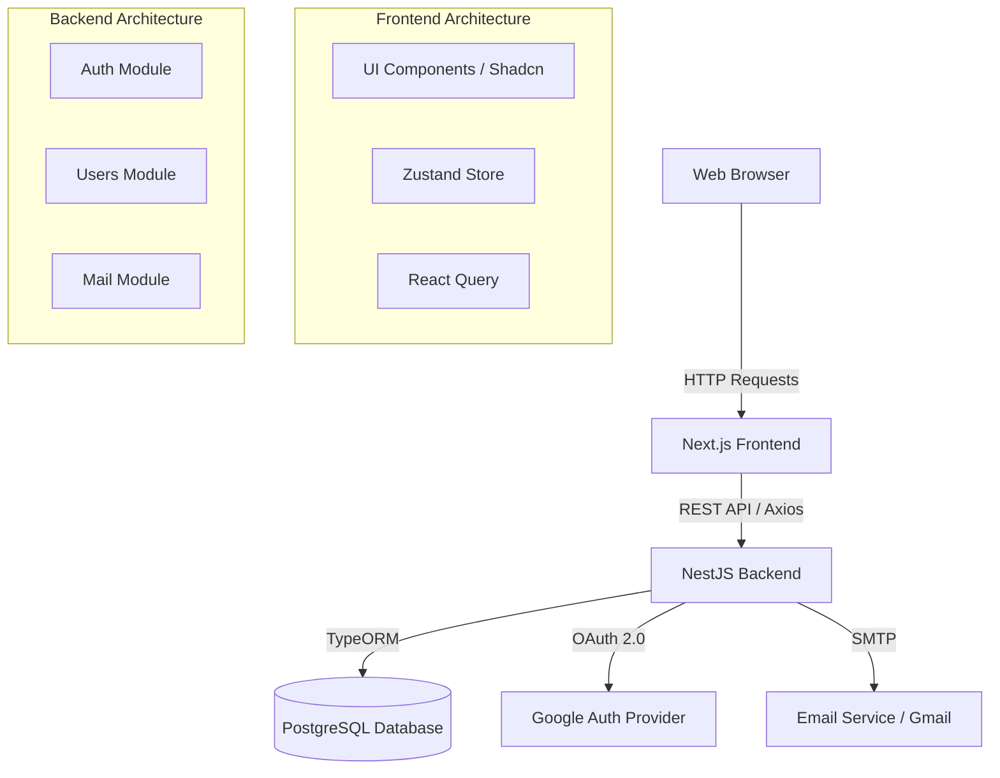
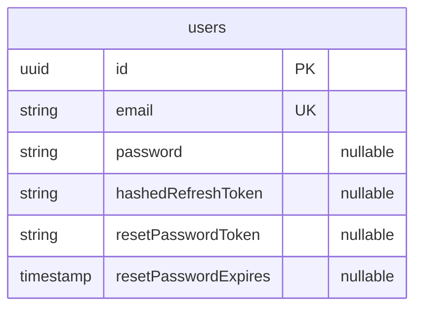

# Enterprise IQ

## 1. Project Overview

**Project Name**: Enterprise IQ
**Purpose**: A full-stack enterprise web application designed with a robust authentication system, providing a secure and scalable foundation for advanced enterprise features.
**Key Features**:
- Secure user authentication (Email/Password & Google OAuth 2.0)
- Session management using JWT (HttpOnly Cookies)
- Password recovery (Forgot/Reset Password)
- Modern and responsive user interface
- Modular backend architecture

**High-Level Architecture Summary**:
The application follows a client-server architecture. The frontend is a Next.js (React) application utilizing modern state management (Zustand) and data fetching (React Query). The backend is a NestJS application built on top of Node.js and Express, using TypeORM to communicate with a PostgreSQL database.

**Target Users and Use Cases**:
Enterprise users requiring secure access to business intelligence or enterprise management tools.

---

## 2. System Architecture



### Flow & Request Lifecycle:
1. **Frontend Request**: The user interacts with the UI (e.g., clicks login). Next.js sends an API request via Axios to the backend.
2. **Backend Processing**: NestJS routes the request to the appropriate controller and service.
3. **Database Access**: Services use TypeORM repositories to fetch or mutate data in PostgreSQL.
4. **Response**: The backend responds with JSON. If authenticating, it sets `HttpOnly` cookies containing JWT access and refresh tokens.
5. **Frontend State Update**: React Query caches the response, and Zustand updates the global application state.

---

## 3. Technology Stack

### Frontend
* **Framework**: Next.js 16 (App Router), React 19
* **Styling**: Tailwind CSS v4, Radix UI, Framer Motion
* **State Management**: Zustand
* **Data Fetching / Caching**: TanStack React Query v5
* **API Communication**: Axios
* **UI Components**: Shadcn UI, Lucide React (Icons)
* **Build Tools**: ESLint, PostCSS, TypeScript

### Backend
* **Runtime**: Node.js
* **Framework**: NestJS 11, Express
* **Database ORM**: TypeORM
* **Authentication**: Passport.js (JWT, Google OAuth 2.0), Bcrypt
* **Mailing**: Nodemailer
* **Validation**: class-validator, class-transformer

### Database
* **Primary Database**: PostgreSQL
* **Caching Layer**: Not currently implemented
* **Vector Databases**: Not currently implemented

### Infrastructure
* *Note: Docker, Kubernetes, and Cloud configuration files are currently missing from the codebase. Deployment is assumed to be manual or managed by external, uncommitted configurations.*

---

## 4. Project Structure

The repository is organized into a monorepo-style structure separating the backend and frontend.

```text
.
├── backend/                  # NestJS API application
│   ├── src/
│   │   ├── auth/             # Authentication logic, guards, strategies
│   │   ├── common/           # Shared utilities, decorators, filters
│   │   ├── mail/             # Email sending services (forgot password)
│   │   ├── users/            # User entity and database interaction
│   │   └── main.ts           # Application entry point
│   └── package.json          # Backend dependencies
│
└── enterpriseiq-frontend/    # Next.js Web application
    ├── app/                  # Next.js App Router pages (e.g., (auth))
    ├── components/           # Reusable React components (Shadcn UI)
    ├── hooks/                # Custom React hooks (React Query mutations/queries)
    ├── lib/                  # Utility functions (e.g., Tailwind merge)
    ├── providers/            # React Context providers (React Query, Theme)
    ├── services/             # Axios API service layer
    ├── store/                # Zustand global state (authStore)
    ├── types/                # TypeScript interfaces and types
    └── package.json          # Frontend dependencies
```

---

## 5. Frontend Documentation

* **Application Flow**: Users land on the application, authenticate via the `(auth)` routes, and are redirected to the protected dashboard.
* **Routing Structure**: Uses Next.js App Router. Routes are defined in `app/`. Auth pages are grouped under `app/(auth)/`.
* **Component Architecture**: Atomic design using Shadcn UI. Components are kept pure and stateless where possible.
* **State Management**: 
  - Server State: Handled by `@tanstack/react-query` (located in `hooks/mutations/` and `hooks/queries/`).
  - Client State: Handled by Zustand (`store/useAuthStore.ts`).
* **API Communication Layer**: Centralized Axios instances in the `services/` directory (`authService.ts`).
* **Authentication Implementation**: Checks for global auth state in Zustand. Uses `useAuthMutation.ts` to trigger backend login endpoints.
* **Environment Variables**: Managed via `.env` file (`NEXT_PUBLIC_API_URL`).

---

## 6. Backend Documentation

* **API Architecture**: RESTful API design using NestJS Controllers.
* **Service Layer Design**: Business logic is separated into injectables (e.g., `AuthService`, `UsersService`).
* **Database Access Layer**: Handled via TypeORM repositories configured in `UsersModule`.
* **Authentication & Authorization**: 
  - Uses Passport.js.
  - Generates an Access Token (15m expiry) and Refresh Token (7d expiry) stored securely in `HttpOnly` cookies.
  - Refresh tokens are hashed using Bcrypt before being stored in the database.
* **Environment Variables**: Loaded globally via `@nestjs/config` using `.env`.

---

## 7. Database Documentation

### Entity Relationship Diagram



### Models
1. **User (`users` table)**
   - **Purpose**: Stores application user credentials and authentication state.
   - **Important Fields**:
     - `email`: Unique identifier for the user.
     - `password`: Bcrypt-hashed password (nullable for Google OAuth users).
     - `hashedRefreshToken`: Securely stores the current refresh token for session rotation.
     - `resetPasswordToken` / `resetPasswordExpires`: Used for the forgot-password flow.

*Note: Migrations and Seed data scripts are not explicitly configured in the current codebase.*

---

## 8. API Documentation

### Authentication (`/auth`)

| Method | Route | Description | Auth Required |
|--------|-------|-------------|---------------|
| `GET` | `/auth/google` | Initiates Google OAuth 2.0 flow | No |
| `GET` | `/auth/google/callback` | Google OAuth callback URL. Redirects to frontend | No |
| `POST` | `/auth/signup` | Registers a new user and sets auth cookies | No |
| `POST` | `/auth/signin` | Authenticates user and sets auth cookies | No |
| `POST` | `/auth/forgot-password` | Sends a password reset email | No |
| `POST` | `/auth/reset-password` | Resets password using a provided token | No |

**Example Request (Sign In)**:
```json
// POST /auth/signin
{
  "email": "user@example.com",
  "password": "securepassword123"
}
```

**Example Response**:
```json
{
  "accessToken": "eyJhbGci...",
  "refreshToken": "eyJhbGci..."
}
// Note: Tokens are also set as HttpOnly cookies automatically.
```

---

## 9. Authentication & Authorization

* **Mechanism**: JWT (JSON Web Tokens) combined with `HttpOnly` cookies to mitigate XSS attacks.
* **OAuth Providers**: Google OAuth 2.0 is integrated using `passport-google-oauth20`.
* **Roles & Permissions (RBAC)**: Not currently implemented. All authenticated users share the same permission level.

---

## 10. Configuration

### Backend (`backend/.env`)

| Variable | Purpose | Required | Example Value |
|----------|---------|----------|---------------|
| `DB_HOST` | PostgreSQL Host | Yes | `localhost` |
| `DB_PORT` | PostgreSQL Port | Yes | `5433` |
| `DB_USERNAME` | PostgreSQL User | Yes | `postgres` |
| `DB_PASSWORD` | PostgreSQL Password | Yes | `secret` |
| `DB_DATABASE` | PostgreSQL Database name | Yes | `enterpriseiq` |
| `JWT_ACCESS_SECRET` | Secret key to sign Access Tokens | Yes | `secret-key` |
| `JWT_REFRESH_SECRET`| Secret key to sign Refresh Tokens | Yes | `secret-key` |
| `PORT` | Backend application port | Yes | `4000` |
| `GOOGLE_CLIENT_ID` | Google OAuth Client ID | Yes | `123.apps.googleusercontent.com` |
| `GOOGLE_CLIENT_SECRET` | Google OAuth Secret | Yes | `GOCSPX-...` |
| `GOOGLE_CALLBACK_URL` | Google OAuth redirect URI | Yes | `http://localhost:4000/auth/google/callback` |
| `SMTP_*` | Nodemailer configuration for emails | Yes | `smtp.gmail.com` |

### Frontend (`enterpriseiq-frontend/.env`)

| Variable | Purpose | Required | Example Value |
|----------|---------|----------|---------------|
| `NEXT_PUBLIC_API_URL` | Base URL for backend API requests | Yes | `http://localhost:4000` |

---

## 11. Third-Party Integrations

1. **Google OAuth 2.0**: Used for single sign-on (SSO). Requires Google Cloud Console project setup with OAuth credentials.
2. **Gmail SMTP**: Used via `Nodemailer` to send password reset emails. Requires an App Password generated from a Google Account.
3. **PostgreSQL**: Relational database used for data persistence.

---

## 12. Local Development Setup

### Prerequisites
* Node.js (v20+)
* npm
* PostgreSQL server running locally

### Installation

1. **Clone the repository**:
   ```bash
   git clone <repository-url>
   cd Enterprise_IQ
   ```

2. **Database Setup**:
   Ensure PostgreSQL is running and create a database matching your `.env` configuration (e.g., `enterpriseiq`).

3. **Backend Setup**:
   ```bash
   cd backend
   npm install
   # Create .env based on the configuration documentation above
   ```

4. **Frontend Setup**:
   ```bash
   cd ../enterpriseiq-frontend
   npm install
   # Create .env containing NEXT_PUBLIC_API_URL
   ```

### Running Locally

**Start the Backend**:
```bash
cd backend
npm run start:dev
```
*(Runs on `http://localhost:4000`)*

**Start the Frontend**:
```bash
cd enterpriseiq-frontend
npm run dev
```
*(Runs on `http://localhost:3000`)*

---

## 13. Docker & Deployment

**Currently Missing**: The project does not currently include a `Dockerfile`, `docker-compose.yml`, or production deployment manifests. 

To deploy to production manually:
1. Build backend: `npm run build` and run `npm run start:prod`. Ensure `synchronize: false` is set in TypeORM config to prevent unintended schema drops.
2. Build frontend: `npm run build` and run `npm run start`.
3. Put both services behind a reverse proxy (e.g., Nginx).

---

## 14. CI/CD

**Currently Missing**: No CI/CD pipelines (e.g., GitHub Actions, GitLab CI) were identified in the codebase. 

---

## 15. Security Considerations

* **Token Storage**: JWTs are stored in `HttpOnly`, `SameSite=strict` cookies, protecting against Cross-Site Scripting (XSS) and Cross-Site Request Forgery (CSRF).
* **Password Hashing**: User passwords and refresh tokens are securely hashed using `bcrypt` before database insertion.
* **Environment Boundaries**: Production flag toggles `secure: true` for cookies, ensuring tokens are only sent over HTTPS.
* *Note: Rate limiting and Helmet (HTTP header security) are currently not configured in the NestJS application and should be added for production readiness.*

---

## 16. Troubleshooting

* **CORS Errors**: Ensure the backend allows requests from `http://localhost:3000`. If you experience issues during Google Auth redirection, verify the frontend domain matches backend expectations.
* **Database Connection Failed**: Double-check `DB_PORT` and `DB_PASSWORD` in `backend/.env`. Ensure the Postgres service is active.
* **Google Auth Fails**: Verify that `GOOGLE_CALLBACK_URL` exactly matches the URI registered in the Google Cloud Console.

---

## 17. Future Improvements

Based on the current architecture, the following improvements are recommended:

* **Dockerization**: Add `Dockerfile` and `docker-compose.yml` for seamless environment bootstrapping.
* **Migrations**: Implement TypeORM migrations instead of relying on `synchronize: true`, which is dangerous in production.
* **RBAC**: Introduce Roles and Permissions to restrict access to specific dashboard features.
* **CI/CD Pipeline**: Implement GitHub Actions to run ESLint, Prettier, and Jest tests on every Pull Request.
* **Security Enhancements**: Add `@nestjs/throttler` for API rate limiting and `helmet` for secure HTTP headers.
